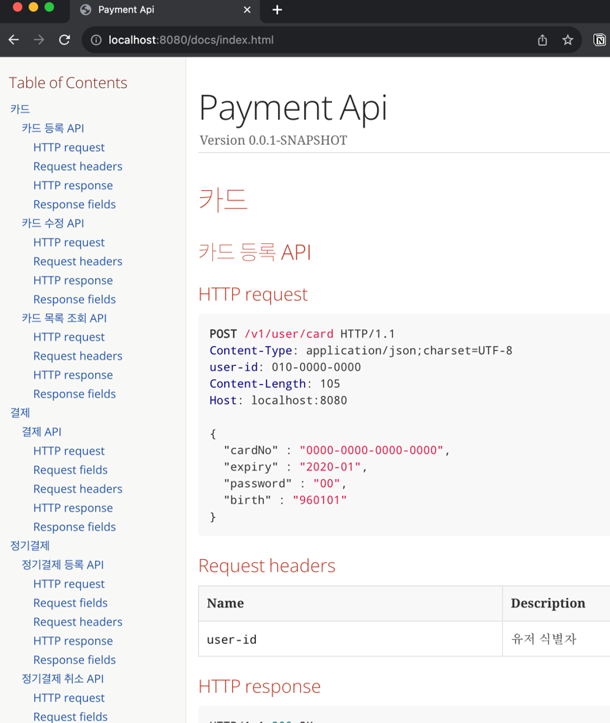

# payment-api

## 프로젝트 정보

```
Java 17 (17.0.4-zulu)
Gradle
Spring Boot 2.7.16
```

## 프로그램 빌드 및 실행

```sh
# 실결제 테스트시 - yml 복사 후 포트원 API키 변경 필요
cp src/main/resources/application.yml.sample src/main/resources/application.yml
```

```sh
./gradlew clean build

java -jar build/libs/payment-0.0.1-SNAPSHOT.jar
```

## 서비스에 제공할 API 명세

```sh
# RestDocs
open http://localhost:8080/docs/index.html
```



## DB 모델링

#### Table: card (카드)

카드정보 등록/조회/수정을 위한 테이블

| 필드명            | 속성           | 키           | 설명            |
|----------------|--------------|-------------|---------------|
| id             | BIGINT       | PRIMARY KEY | 카드 ID         |
| user_id        | VARCHAR(255) | NOT NULL    | 사용자 식별자 (휴대폰) |
| billing_key    | VARCHAR(255) | UNIQUE      | 빌링키           |
| masked_card_no | VARCHAR(255) | NOT NULL    | 마스크된 카드 번호    |
| card_name      | VARCHAR(255) | NOT NULL    | 카드 이름         |
| created_at     | TIMESTAMP    | NOT NULL    | 레코드 생성 시간     |
| updated_at     | TIMESTAMP    | NOT NULL    | 레코드 수정 시간     |

- 인덱스: `idx_user_id` on `user_id`

#### Table: payment (결제)

결제/취소 처리 테이블

| 필드명                | 속성           | 키           | 설명                   |
|--------------------|--------------|-------------|----------------------|
| id                 | BIGINT       | PRIMARY KEY | 결제 ID                |
| user_id            | VARCHAR(255) | NOT NULL    | 사용자 식별자 (휴대폰)        |
| card_id            | BIGINT       | FOREIGN KEY | card 테이블 참조          |
| transaction_id     | VARCHAR(255) | UNIQUE      | 트랜잭션 아이디 (중복결제 방지)   |
| partner_payment_id | VARCHAR(255) | UNIQUE      | 파트너 결제 아이디 (포트원 조회키) |
| service_key        | VARCHAR(255) | NOT NULL    | 서비스 키                |
| product_name       | VARCHAR(255) | NOT NULL    | 상품 이름                |
| amount             | BIGINT       | NOT NULL    | 결제 금액                |
| cancel_amount      | BIGINT       | NOT NULL    | 취소 금액                |
| status             | VARCHAR(50)  | NOT NULL    | 결제 상태                |
| created_at         | TIMESTAMP    | NOT NULL    | 레코드 생성 시간            |
| updated_at         | TIMESTAMP    | NOT NULL    | 레코드 수정 시간            |

- 외래 키: `card_id` references `card(id)`

#### Table: payment_history (결제 스냅샷)

결제/취소로 payment 테이블 레코드 변경시 동일 트랜잭션으로 쌓여야 하는 증적 테이블

| 필드명                | 속성           | 키           | 설명                   |
|--------------------|--------------|-------------|----------------------|
| id                 | BIGINT       | PRIMARY KEY | 자동 증가 아이디            |
| payment_id         | BIGINT       | FOREIGN KEY | payment 테이블 참조       |
| user_id            | VARCHAR(255) | NOT NULL    | 사용자 식별자 (휴대폰)        |
| card_id            | BIGINT       | FOREIGN KEY | card 테이블 참조          |
| transaction_id     | VARCHAR(255) | UNIQUE      | 트랜잭션 아이디 (중복결제 방지)   |
| partner_payment_id | VARCHAR(255) | UNIQUE      | 파트너 결제 아이디 (포트원 조회키) |
| service_key        | VARCHAR(255) | NOT NULL    | 서비스 키                |
| product_name       | VARCHAR(255) | NOT NULL    | 상품 이름                |
| amount             | BIGINT       | NOT NULL    | 거래 금액                |
| cancel_amount      | BIGINT       | NOT NULL    | 취소 금액                |
| status             | VARCHAR(50)  | NOT NULL    | 결제 상태                |

- 외래 키: `payment_id` references `payment(id)`

#### Table: subscription (정기결제)

| 필드명                    | 속성           | 키           | 설명            |
|------------------------|--------------|-------------|---------------|
| id                     | BIGINT       | PRIMARY KEY | 정기결제 ID       |
| card_id                | BIGINT       | FOREIGN KEY | card 테이블 참조   |
| user_id                | VARCHAR(255) | NOT NULL    | 사용자 식별자 (휴대폰) |
| amount                 | BIGINT       | NOT NULL    | 구독 금액         |
| payment_date           | DATE         | NOT NULL    | 결제 날짜         |
| status                 | VARCHAR(50)  | NOT NULL    | 구독 상태         |
| service_key            | VARCHAR(255) | NOT NULL    | 서비스 키         |
| service_transaction_id | VARCHAR(255) | NOT NULL    | 서비스 트랜잭션 아이디  |

- 인덱스: `idx_subscription_daily` on `payment_date`, `status`
- 외래 키: `card_id` references `card(id)`

#### Table: subscription_payment (정기결제 이력)

정기결제 배치 실패시 중복 결제를 방지하기 위한 테이블

| 필드명             | 속성          | 키           | 설명                  |
|-----------------|-------------|-------------|---------------------|
| id              | BIGINT      | PRIMARY KEY | 자동 증가 아이디           |
| subscription_id | BIGINT      | FOREIGN KEY | subscription 테이블 참조 |
| payment_date    | DATE        | NOT NULL    | 결제 날짜               |
| status          | VARCHAR(50) | NOT NULL    | 결제 상태               |

- 외래 키: `subscription_id` references `subscription(id)`

## 고민 및 접근/해결 방식

* 카드정보는 저장해야 하는가?
    * 카드번호를 저장하기 위해서는 암호화 및 관리부담의 이슈가 있음
    * 빌링키 정기결제 방식으로 필요하지 않을것으로 느껴 저장하지 않음, 카드 앞 4자리만 저장/조회하도록 함
* 각 서비스 A,B,C 의 결제를 어떻게 관리할 것인가?
    * 각 서비스에서 결제시 serviceKey (서비스키), serviceTransactionId (서비스 거래키) 를 보내도록 하여 증적/관리에 유용하게 함
    * 카드는 어떤 서비스에서 등록하든 구분없이 사용 가능하도록 서비스키 구분을 두지 않음
* 아키텍처는 어떻게 구성 할 것인가?
    * 계층형 아키텍처 채택, 헥사고날의 일부 개념 적용 inbound (웹, 이벤트 구독자), outbound (이벤트 발행자)
    * 한개의 메소드만 갖는 Command (저장/실행), Query (조회) 객체로 구성하여 SRP를 따르려 노력함
        * PaymentCreator : 결제 생성 책임
        * PaymentCanceler : 결제 취소 책임
* 배치 스케줄러는 어떻게 구성할 것인가?
    * Spring Boot 어플리케이션이 직접 스케줄링 하기엔 어플리케이션 상태에 따라 가변, 증적의 어려움이 있음
    * 배치 증적 및 재시도의 용이함과 어드민의 필요성으로 인해 젠킨스가 트리거 하도록 함
        * `Jenskins -> 어플리케이션 빌드 -> curl /batch/v1/subscription/payment/{paymentDate}`
        * 젠킨스는 과제 내 구현하지 않았으며, API 트리거만 구현험
* 정기결제가 실패할경우 어떻게 대처할 것인가?
    * 배치 트리거 -> 당일 정기 결제 대상 목록 조회 (jpa cursor) -> messageQueue 결제 이벤트 발행
    * messageQueue consumer 가 건별 결제를 처리하도록 함
        * 과제는 messageQueue 를 ApplicationEventPublisher 로 구현
        * 건별 실패시 재시도 처리는 구현하지 않음, dead letter queue 등을 구성하여 재시도 구현 필요
    * 재시도시 재결제 방지를 위해 subscription_payment (정기결제 이력) 테이블 구성
* 포트원 장애시 어떻게 대처할 것인가?
    * 포트원 장애 전파를 줄이기 위해 서킷 브레이커 적용
    * (포트원 결제 시도 -> 너무 느린 응답) 케이스의 경우 응답을 못받아도 사용자의 카드는 결제되었을 수 있음
        * 너무 느린응답인 경우 fallback 으로 결제 취소 API 실행 구현이 필요할 수 있음 (미구현)
* 프로젝트 배경상 기존서비스가 존재함, 신규 결제 서비스 오픈시 롤백 플랜은 어떻게 구성할 것인가?
    * 듀얼라이팅 전략이 필요할 수 있음 (미구현)
        * 신규 서비스 결제 -> 이벤트 큐 -> 각 레거시 서비스별 결제 테이블 형태에 맞게 insert
* 통합테스트 분리
    * 테스트에 꼭 필요한 의존성만 주입하기 위해 통합테스트인 경우에만 `@SpringBootTest` 적용
    * Restdocs 테스트는`@WebMvcTest` 적용
    * DB 테스트 `@DataJdbcTest` 는 구현하지 않았음

## 미구현한 부분

* 카드번호 등 유효성 검사
    * 컨트롤러에서 카드번호, 비밀번호등 적절한 유효성 로직을 추가해야함
